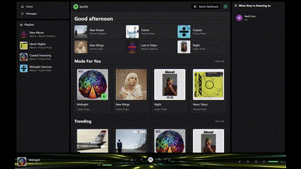
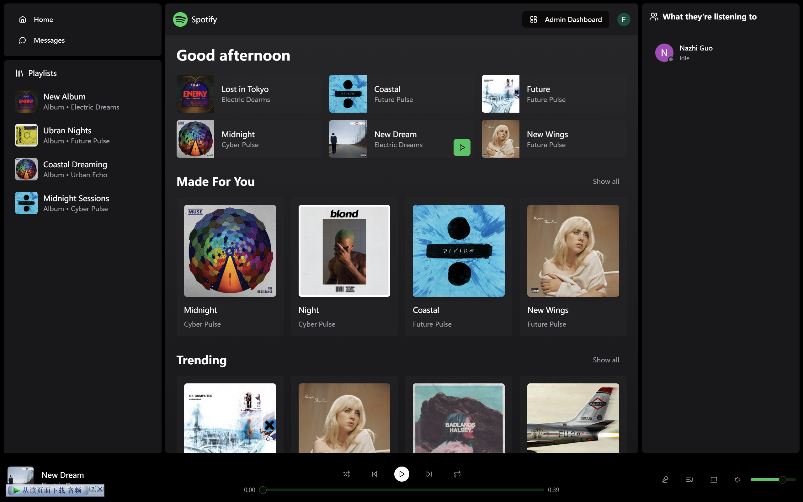
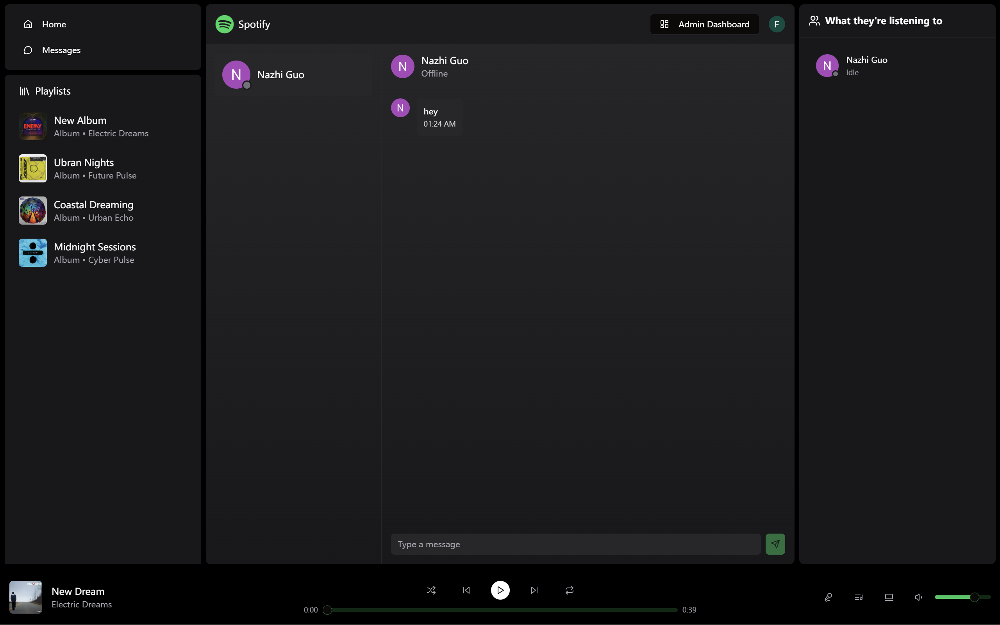
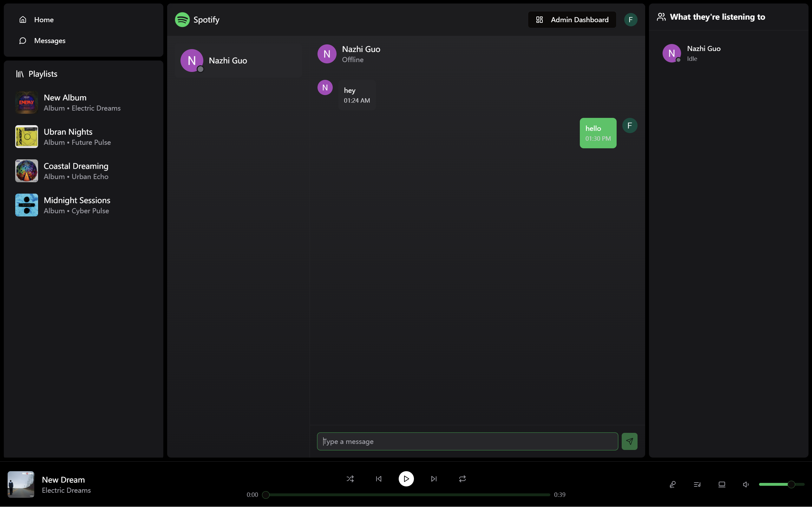
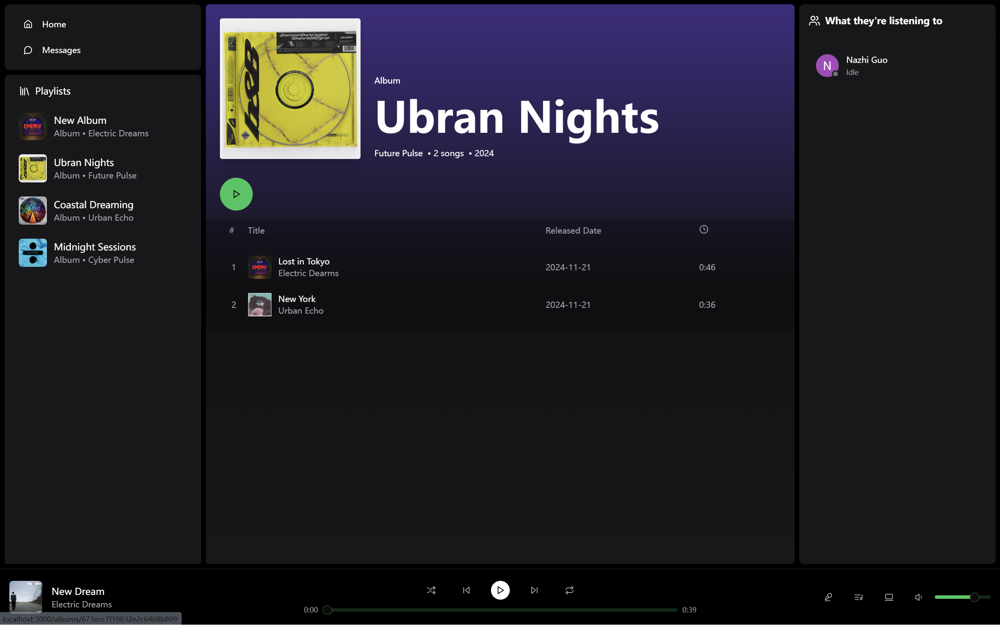
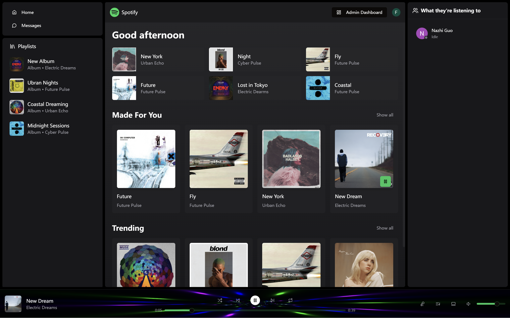
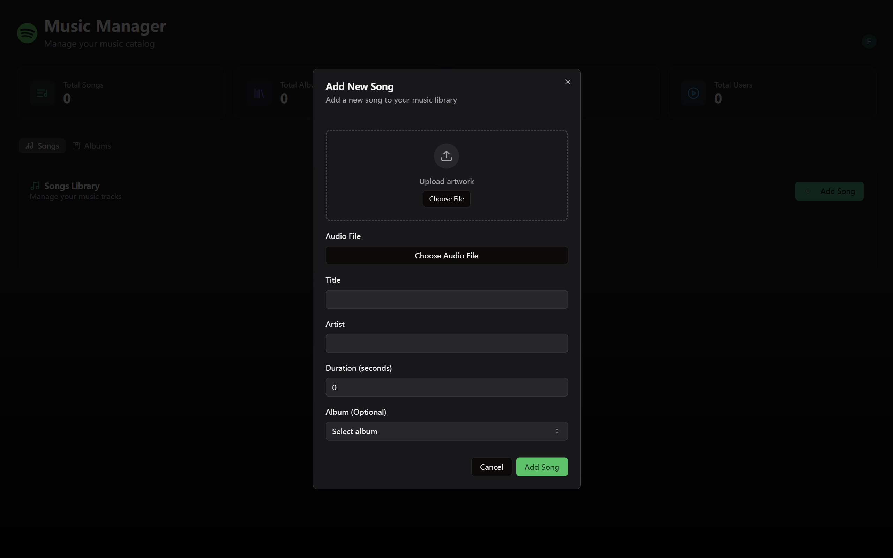
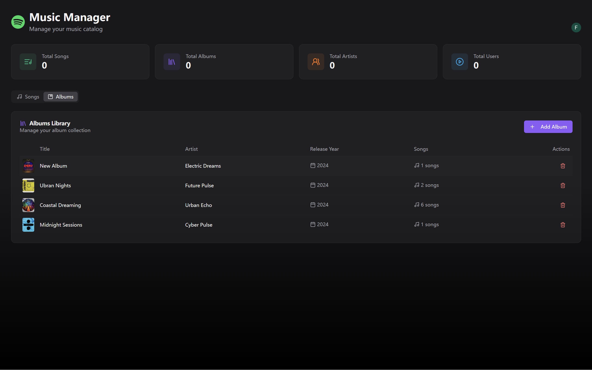
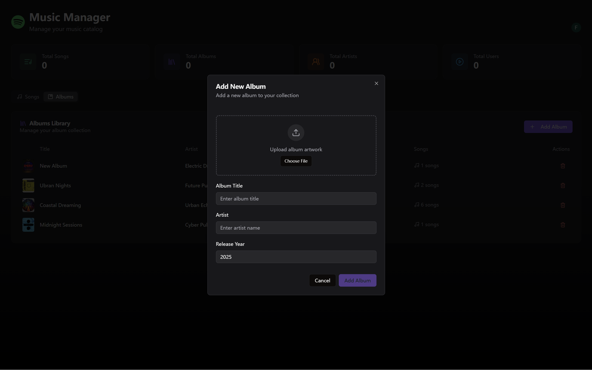

# 🎵 Emotion-Driven Online Music Platform

## 🚀 **Project Overview**
An innovative online music platform that combines real-time emotion recognition with modern web technologies to deliver a personalized and engaging music listening experience. The platform leverages deep learning and cutting-edge front-end development to redefine how users interact with music.

---
## 🔗 Full Analysis

You can see the complete **model training process** in the link below：

📊 [Complete Model Training Process](https://colab.research.google.com/drive/1OXgVuHh-1RExglcYuX1c3bWSYamlR5MX?usp=sharing)

---
### 🔑 **Key Features**
- 🎸 **Listen to Music**: Seamlessly play, pause, and skip between songs with a sleek and intuitive UI.
- 🔈 **Volume Control**: Adjust playback volume using an interactive slider.
- 🎧 **Admin Dashboard**: A feature-rich admin panel for managing albums and songs.
- 💬 **Real-Time Chat**: Chat with other users directly within the platform, with integration to Spotify.
- 👨🏼‍💼 **User Presence**: See online/offline status for enhanced interaction.
- 👀 **Real-Time Activity Feed**: View what others are listening to in real time.
- 📊 **Analytics Dashboard**: Aggregate and visualize data insights, including user behavior and song preferences.
- 🎨 **Emotion Visualization**: Visualize the emotional content of music during playback, powered by CRNN deep learning.

---

## 💡 **Technical Stack**

### **Frontend**
- **React + TypeScript**: For building a scalable, type-safe, and dynamic user interface.
- **Vite**: For ultra-fast development and optimized builds.
- **WebSocket Integration**: Enabling real-time communication for chat and user status.
- **HTML5 Audio API**: For seamless music playback and volume control.

### **Backend**
- **Node.js + Express**: Backend server for handling API requests and real-time updates.
- **Socket.IO**: Ensures low-latency communication for chat and activity tracking.
- **MONGODB**: A source-available, cross-platform, document-oriented database program.

### **Deep Learning**
- **CRNN (Convolutional Recurrent Neural Network)**:
  - Used for high-accuracy music emotion recognition.
  - Predicts emotion indices from audio features with an average error margin of just **0.1**.
  - Trained on a large dataset of annotated music to identify emotional states such as happiness, sadness, anger, and calmness.

### **Emotion Visualization**
- Dynamic graphs and visual elements representing the detected emotions in real-time during playback.

---

## 📖 **Deep Learning and Music Emotion Recognition**
- Utilizes a **CRNN model** to analyze the emotional content of music.
- Model input: Preprocessed audio spectrograms.
- Output: Emotion indices (e.g., happiness, sadness) mapped to a visual representation.
- **Accuracy**: Achieved a high level of precision, with average prediction error below **0.1**.
- Real-time emotion feedback enhances user engagement and personalization.

---

## 🌟 **Highlights of the Platform**
1. **Emotion-Aware Music Playback**:
   - Users can see real-time visualizations of music emotions.
   - Emotions are represented as dynamic, colorful graphs, creating an immersive listening experience.

2. **Admin Dashboard**:
   - Simple yet powerful interface for managing music libraries.
   - Add, delete, or update albums and songs effortlessly.

3. **Social Interaction**:
   - Real-time chat and activity feeds foster community engagement.
   - Users can discover what their friends or others are listening to.

4. **Analytics Page**:
   - Aggregates listening habits and user interactions.
   - Provides actionable insights for improving user experience.

---

## 🎥 Demo

Here's a quick look at some of the outputs from the project:

###  **WebsiteDemo**

---
